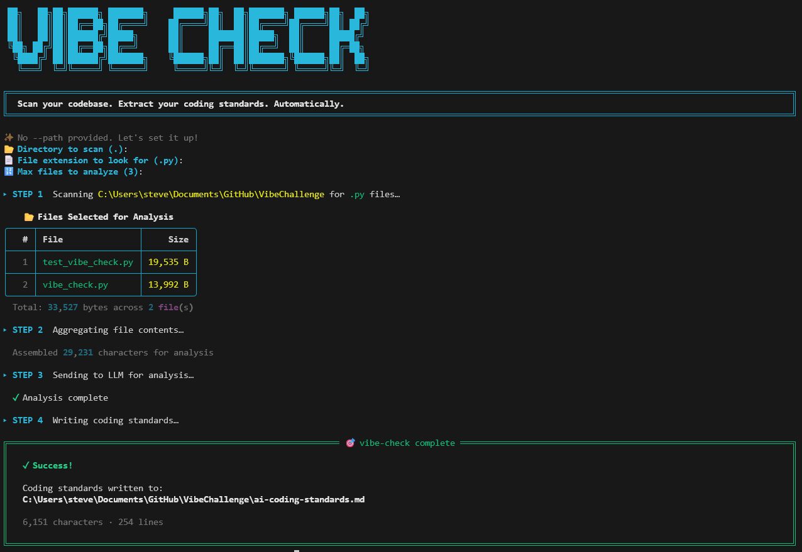

# NOTE: This project is 100% vibe coded, its contents do not reflect my style or ability, only the idea and design

3rd place prize winner for the 2026 Vibe Code Competition. This hackathon lasted 1hr and tasked participants to create a developer tool using AI.

# 🎯 vibe-check



**Scan your codebase. Extract your coding standards. Automatically.**

`vibe-check` is a Python CLI developer tool that scans a local directory for source files, extracts their contents, and sends them to Groq's blazing-fast LLM API (Llama 3.3 70B) to generate a customized `ai-coding-standards.md` file that defines your project's strict coding conventions.

## ✨ Features
- **Smart Discovery**: Automatically finds the largest relevant files in your project while intentionally ignoring trap directories (`venv`, `.git`, `__pycache__`, `node_modules`, etc.).
- **Token Efficient**: Grabs only the top N largest files so you don't blow up your context window.
- **Beautiful CLI**: Interactive terminal UI with rich formatting, tables, and progress spinners.
- **Free & Fast**: Powered by Groq for instant, free inferences using LLaMA models.

## 📦 Installation

1. Clone this repository or download the files.
2. Install the required dependencies:

```bash
pip install -r requirements.txt
```

## 🔑 Setup API Key

You need a free Groq API key to run the tool. Get one at [console.groq.com](https://console.groq.com).

Set it as an environment variable so you don't have to keep typing it:

**Windows (PowerShell):**
```powershell
$env:GROQ_API_KEY = "your-api-key-here"
```

**Mac/Linux (bash/zsh):**
```bash
export GROQ_API_KEY="your-api-key-here"
```

## 🚀 Usage

**Basic usage** (scan the current directory for `.py` files):
```bash
python vibe_check.py --path .
```

**Scan a specific project path:**
```bash
python vibe_check.py --path C:\Projects\MyCoolApp
```

**Scan for a different file extension** (e.g., JavaScript):
```bash
python vibe_check.py --path . --ext .js
```

**Analyze more files** (e.g., top 5 largest instead of 3):
```bash
python vibe_check.py --path . --top 5
```

If you prefer to **pass your API key directly**:
```bash
python vibe_check.py --path . --api-key <YOUR_KEY>
```

## 📄 Output

After the scan completes, the tool generates an **`ai-coding-standards.md`** file in the root of the scanned directory. It contains extracted conventions for:
- Naming Conventions
- Comment Styles
- Docstring Formats
- Import Ordering
- Error Handling
- Architectural and Anti-Patterns

## 📝 License
See the `LICENSE` file in the repository for more details.
